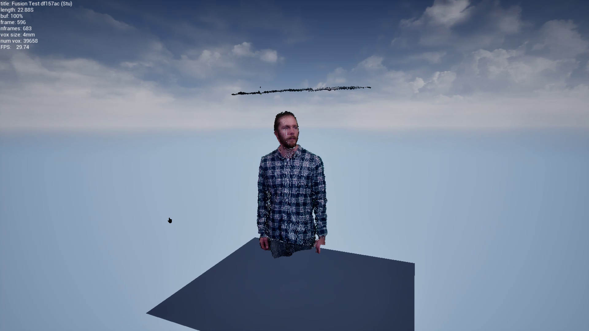

## vimr_player



A standalone VoxelVideo player for videos captured using [vimr](https://github.com/sjmduncan/vimr).

[Download here](https://github.com/sjmduncan/vimr_player/releases/download/0.9e/2025-02-07-vimr_player_0.9e_win64.zip)

Requires [3DConnexion SpaceMouse driver](https://3dconnexion.com/uk/drivers/)

## Controls


- Left-click and drag: Look around
- Right-click and drag: Move around in horixontal plane
- L+R click and drag: Move around
- Esc or Alt+F4: exit


## Citation

```bibtex
@article{duncan2021voxelbased,
    author = {Duncan, Stuart and Park, Noel and Ott, Claudia and Langlotz, Tobias and Regenbrecht, Holger Regenbrecht},
    title = {Voxel-Based Immersive Mixed Reality: A Framework for Ad Hoc Immersive Storytelling},
    journal = {PRESENCE: Virtual and Augmented Reality},
    volume = {30},
    pages = {5-29},
    year = {2021},
    month = {12},
    issn = {1054-7460},
    doi = {10.1162/pres_a_00364},
}
```